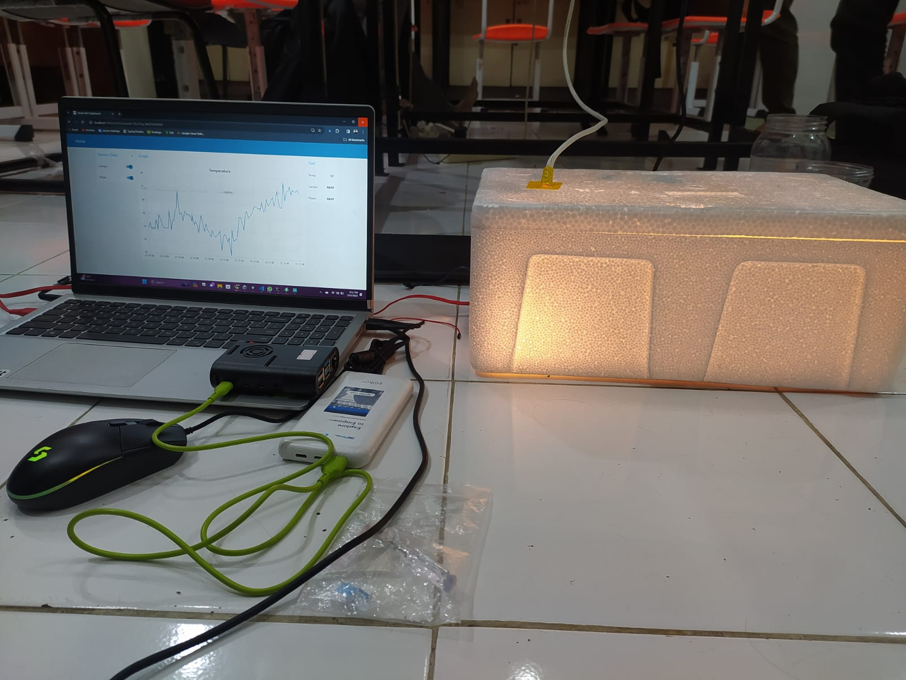

## MONITORING TEMPERATURE INSIDE A BOX IOT PROJECT

Monitoring temperature inside a box using an ESP32 microcontroller, an LM35 temperature sensor, a light bulb (for heating), and a PC fan (for cooling). The system uses a Raspberry Pi single-board computer (SBC) for data processing and visualization, and communicates via the MQTT protocol. Node-Red Dashboard is used for creating a user interface for monitoring and controlling the temperature in real time. The light bulb and PC fan are controlled based on the temperature readings to maintain a desired temperature range.

## Screenshot

